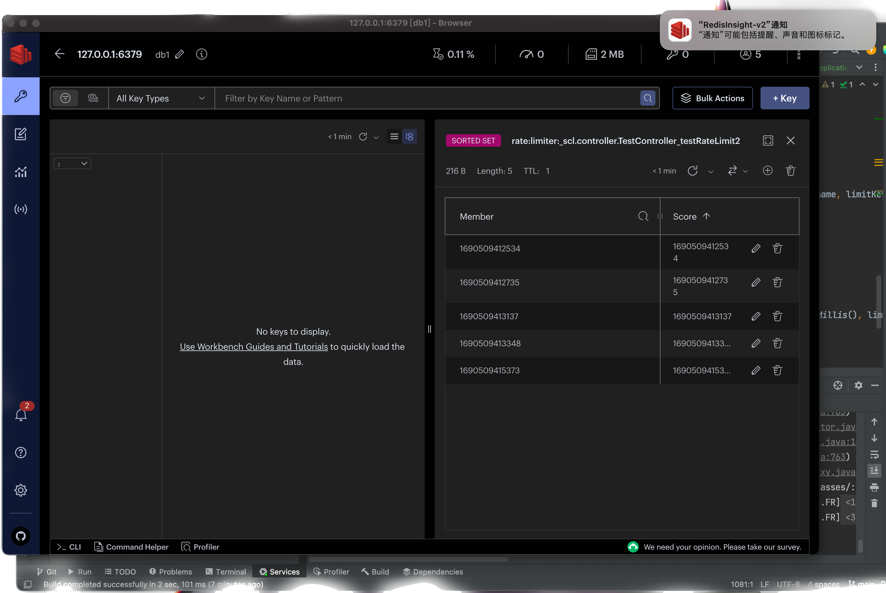

### api限量方案-使用redis基于滑动窗口思路对接口限流demo

参考：
- https://blog.csdn.net/wujiangbo520/article/details/126994293
- https://juejin.cn/post/7109055415668867080

#### 常见限流思路

1、固定时间段：请求累计，达到阈值请求被拒绝，某个时刻清空累计量，实现的话可以redis的key存储ip+接口名称，value存储当前接口访问次数

缺点：限流时间段是固定的，清空时间前后可能会造成2n-1访问量

2、滑动窗口：请求累计，但是时间段为动态的，比如10s内只能访问5次，用户每次访问的时候记录访问时间戳，并计算前10s内用户访问接口的总次数，超过阈值则拒绝

3、...

#### 实现
可以借助redis，对于滑动窗口方式，在选用redis数据结构时可以考虑zSet

- zSet有一个score属性，可以考虑把访问的时间戳设置为score，底层结构是跳表或者顺序表，可以高效排序。
- 使用score进行范围检查，思路是把特定时间间隔之前的member都删除 `Zremrangebyscore [key] [min] [max] `，留下的key就是时间间隔内访问次数可以使用 `ZCARD [key]`，在和阈值比较

可以配合AOP注解来实现

- 定义注解@RateLimit
- 导入redis的依赖，配置RedisTemplate
- 导入aop的依赖，定义AOP切面类，切面内部读取注解配置，调用lua脚本
- 定义测试Controller，测试，频繁访问redis，然后观察redis

