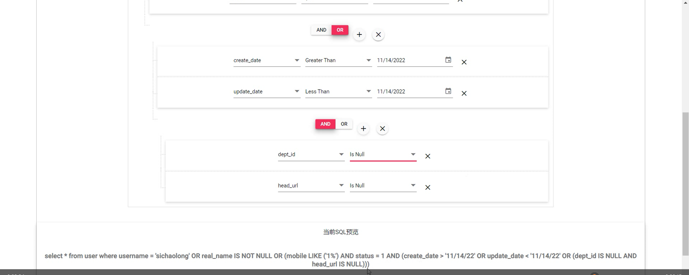

#### 基于spingboot+vue的query-builder

##### 需求

数据库中有⼀个表（例如下⾯的 act_card_result），现在需要在后台⻚⾯上，做⼀个可以灵活筛 选数据的功能（从SQL的⻆度来说，就是拼接 WHERE 后⾯的查询语句），⽅便业务⼈员导出表⾥⾯的 数据，类似数据库管理⼯具 Navicat 的筛选功能。


##### 说明

目前市面上常见的实现方式有几种

1. jquery-query-builder：基于原生js方式实现，官网[jQuery QueryBuilder](https://querybuilder.js.org/)，在vue中使用不是很方便。
2. vue-query-builder：基于vue方式，安装可以使用npm，但是bug较多，功能不完善，git主页说作者在2022-01-19停止维护。
3. query-builder-vue：基于vue方式，和上面类似，相比上面更加完善一点，但是还是有bug如样式不能显示等，https://www.npmjs.com/package/query-builder-vue
4. ej2-query-builder：国外另一款基于vue实现的，丰富的组件和样式，教程较为详细，对非专业前端较为友好，官网地址https://ej2.syncfusion.com/vue/documentation/introduction/


```java
项目结构：
/---confg // mybatis逆向模块配置
/---logs // mybatis逆向模块日志
/---mybatis-generator-gui-master // mybatis模块，逆向生成model、dao、mapper
/---tomato-of-life-query-builder-back // springboot后端
/---tomato-of-life-query-builder-vue // vue前端，基于上述第四种方式ej2-query-builder实现

```


其中上述实现的基本原理：**通过js将表单中选取的规则取出来，有些组件可以前端使用DataManager来通过webAPI形式从后端拉去数据处理，或者是前端将选取的规则以JSON、SQL的形式传给后端，后端解析数据，转化sql，查询数据返回给前端。**


本练习中使用的是前端根据规则生成SQL然后post到后端，后端使用MyBatis-Plus的xml完成动态查询。

##### 效果




