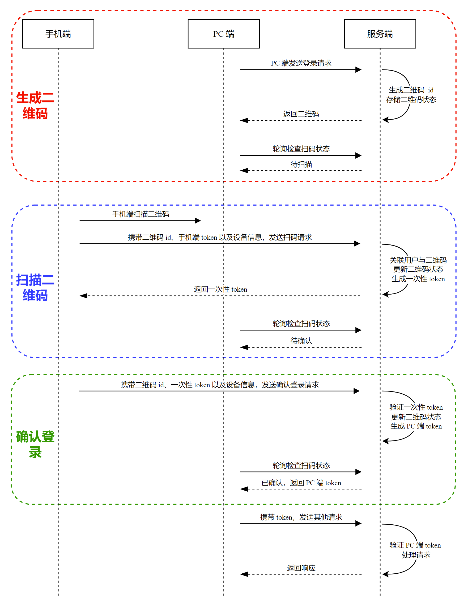

#### 扫描二维码登录demo

参考：https://www.cnblogs.com/johnlearning/p/16205875.html

前言：简单分析扫码登录流程。

场景：以网页版微信为例，我们在 PC 端点击二维码登录后，浏览器页面会弹出二维码图片，此时打开手机微信扫描二维码，PC 端随即显示 "正在扫码"，手机端点击确认登录后，PC 端就会显示 "登陆成功" 了。

流程概述

- PC端：
  - 展示二维码，服务端产生二维码id以及二维码图片，显示之后PC端通过轮询的方式向服务端发请求，时刻监控移动端扫码动作，为了得到最后存储在服务器端的token，完成登录。
- 移动端：
  - 手机扫描二维码会发一个请求，具体请求的信息藏在二维码中，除了请求的url还有二维码的id
- 服务端：
  - 二维码图片由服务端产生，并且会产生请求的url、二维码id 存储在二维码图片中
- 二维码：
  - 除了请求登录的url外，在二维码图片生成之前，服务端一般需要先生成一个二维码id，绑定着二维码的状态（是否被扫描）、过期时间等等，这个二维码信息会存储在服务端。
  
  
二维码的状态：一般分为4个

- 1、生成二维码：PC端点击按钮，会向服务端发送请求二维码图片，此时服务端生成二维码id，将这个id与二维码的状态存储起来，比如redis中

- 2、待扫描：二维码最初的状态是 待扫描

- 3、待确认：移动端扫描之后，会像服务端发送第一个请求，会携带二维码id，手机端token，设备信息，服务端收到请求，会生成一个临时linshi-token响应，该 linshi-token 用作确认登录的凭证。会将状态改为 待确认。此时PC端的轮询请求到服务端，发现状态为 待确认，则更新PC端的页面，比如显示已扫描，请移动端确认登录

- 4、已确认：移动端确认登录之后，会向服务端发送第二个请求，会携带二维码id，手机端token，设备信息，linshi-token,服务端会根据移动端的登录态为PC端生成pc-token，可以存在redis中，PC端下一次轮询请求服务端的时候，就可以拿到这个pc-token，然后登录成功。

上述过程中，我们注意到，手机端扫码后服务端会返回一个一次性 linshi-token，该 linshi-token 也是一种身份凭证，但它只能使用一次。一次性 linshi-token 的作用是确保 "扫码请求" 与 "确认登录" 请求由同一个手机端发出，也就是说，手机端用户不能 "帮其他用户确认登录"。

本地测试扫码登录
- 拉下代码：
- 启动app，执行单元测试的代码模拟移动端登录，以及模拟服务端生成移动端的access_token
- 打开网页localhost:8080/index,显示需要扫描的二维码
- 打开postman，首先访问`localhost:8080/login/scan?uuid=4861f8a9863d474c9ffe57cb48a55f73`,后面的uuid去浏览器找，然后请求header加上上一步的access_token。然后响应中会返回once_token，观察页面已经是 待确认。
- 打开postman，接着访问`localhost:8080/login/confirm?uuid=4861f8a9863d474c9ffe57cb48a55f73`，然后请求header加上上一步的once_token，然后响应中会返回登录成功，观察页面已经完成PC端登录。

